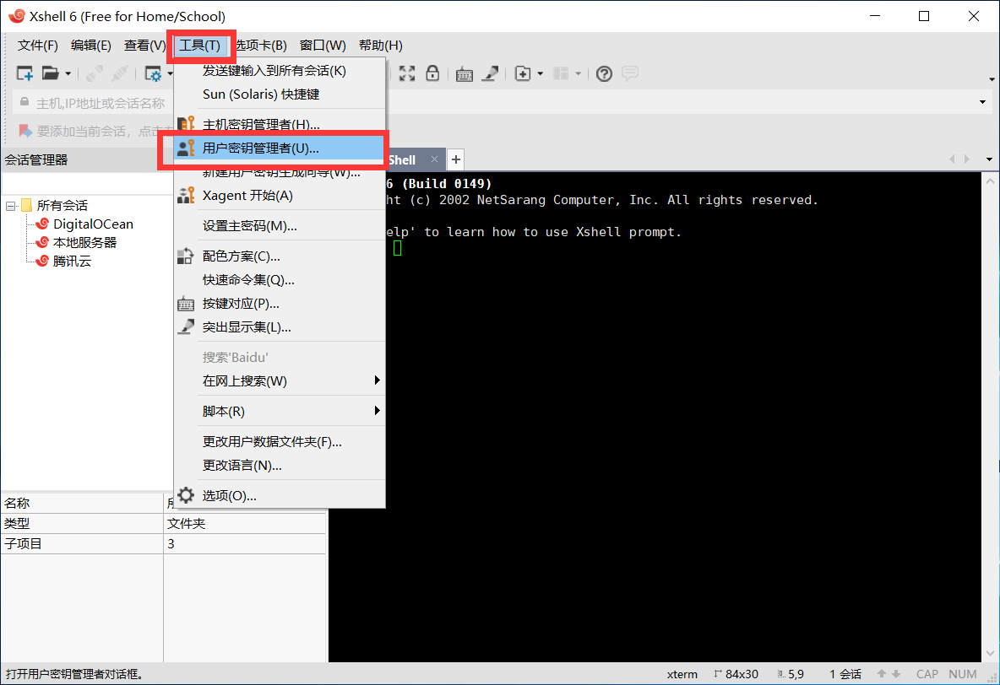

## Motivation
1. 不想每次上传代码都要输入用户名和密码。
2. 如果想要使用GitHub搭建个人博客，一般会推荐使用ssh进行连接。


## Preview

传统的教程，一般都是从申请github账号开始教学，而且大部分的教程都是给出几行命令，没有说明这几行命令的作用。

这种方法就会导致，如果配置不成功，也不知道出现的问题在于哪里！更重要的是，现在很多教程还是沿用老一套的方法，对比几年前的教程，会发现基本一样。

## Analyze

首先从SSH的连接开始，SSH连接之所以安全是因为又公钥和私钥配对的机制。在服务器端添加公钥，在本地端保存私钥，连接时会扫描本地的私钥和远端的公钥是否配对，如果配对则建立连接。

现有很多教程都是教你使用ssh -keygen 命令生成，但是其实完全可以使用一些软件生成，例如Xshell。另外ssh命令生成的秘钥的文件名通常是id_rsa，如果你是首次生成秘钥，这完全没有问题。但是如果你之前已经配置过多次秘钥，则很有可能已经存在id_rsa的秘钥。所以在此说明，秘钥完全可以修改名字，换成很有意义的文件名。我在.ssh/文件夹下就生成了多个秘钥，包含两个云服务器的秘钥和两个github账号的秘钥。

另，ssh连接GitHub与ssh连接远程的云服务器的原理是一样的，所以完全可以使用ssh连接云服务器的方式去配置github的SSH连接！例如使用ssh下载项目的命令为：```git clone git@github.com:username/repository.git```和```ssh username@ip ```对比，可以认为，```git@github.com```中```git```是用户名，```github.com```是域名地址。这个也是配置config文件的一个依据！

## Step

1. 使用Xshell生成秘钥对，将公钥保存至.ssh/文件夹下(其实公钥保存的位置没有关系，最主要的额还是需要将私钥保存在这个文件夹下)，同时将私钥也导出至该文件夹。在生成过程中，文件可命名为id_rsa_github。
2. 使用文本编辑器打开XX.pub（公钥文件），复制文件内容，粘贴至github中setting中的SSH key 中。
3. 配置.ssh/文件夹下的config文件（若没有，则新建）！文件配置如下（之所以配置这个文件，是为了更好的为公钥和私钥配对）：
   ```config
    Host github.com
    Hostname github.com
    User git
    IdentityFile C:\Users\WenxingZhu\.ssh\id_rsa_github

   ```

4. 使用命名测试是否连接成功```ssh -T git@github.com ```.如果成功会显示```Hi <your github username>! You've successfully authenticated, but GitHub does not provide shell access.```

使用这种方法可以很灵活的配置多个git账号，因为就是多生成几个公钥秘钥对及在config上多配置几个主机连接信息。主要修改的就是```Host```的字段，可以一个是```username1.github.com```，另一个是```username2.github.com```,hostname的值不需要修改，仍然是```github.com```，Host之所以要修改，是因为它类似于是一个别名，需要有唯一性。这样修改之后，是使用git命令也需要记得修改，例如```git@username1.github.com:username1/repository.git```

参考：
* [使用 SSH 连接到 GitHub（多帐号）](https://io-oi.me/tech/ssh-with-multiple-github-accounts/)
